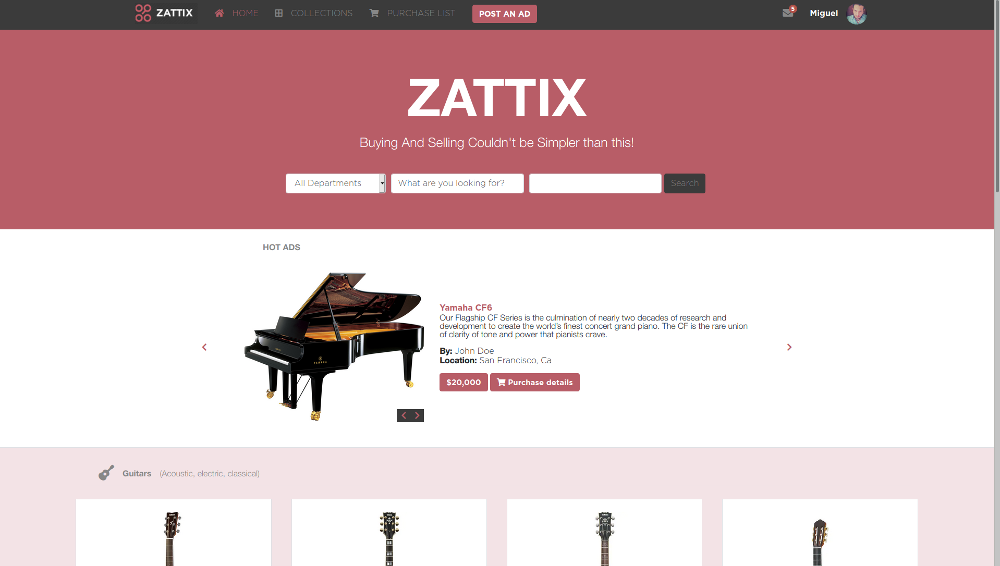
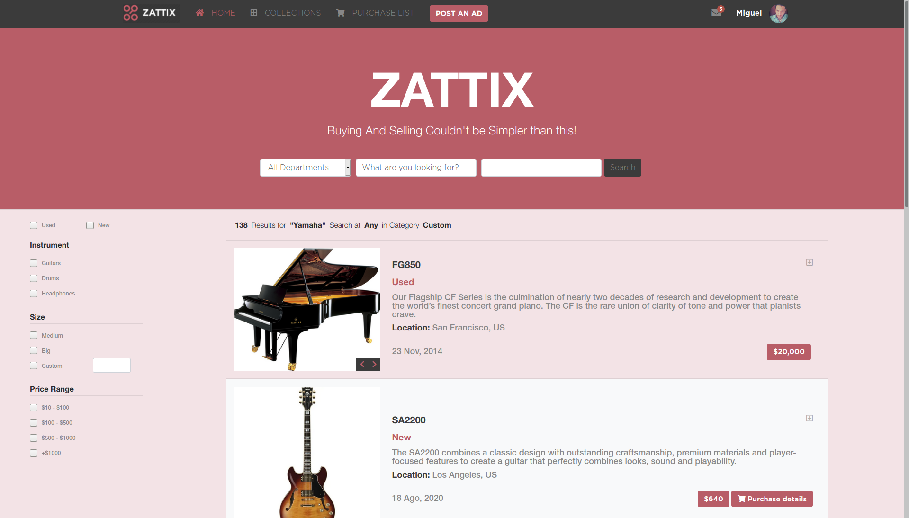

# HTML & CSS CAPSTONE PROJECT: A CUSTOM SHOP. 

> A beautiful musical instruments shop built with business specifications based on the design by Mohammed Awad.

## This is the main homepage.

## This is the product search page.

## Built With

- HTML 5
- CSS Flexbox
- CSS Grid
- BootStrap

## Validators:

  *  W3C validator for HTML
  *  Stickler for "Style Matters" stickler
  *  Stylelint for VSCode

## Check out a Live Demo [Here](https://raw.githack.com/Meltrust/HTML-capstone-project-shop/develop/index.html)

## Watch a video with the presentation of the project [here]()

## Getting Started:

To get a local copy up and running follow these simple example steps:

1. Under the repository name, click the Clone or download green button.

2. Copy the URL given by clicking the clipboard button

3. Open a terminal window in your local machine and change the current directory to the one you
   want the clone directory to be made.

4. Type  git clone and the paste the URL you previusly copied to the clipboard

5. Change the current directory to the newly created folder

6. Now open the index.html file on your browser. Use the menu to go to the catalogue of products.
   By clicking on one product, you will be taken to the product page. You can test these three pages
   changing the width of your browser window. The content will fit either to desktop and mobile screen
   sizes.

## 🤝 Contributing

Contributions, issues and feature requests are welcome!

Feel free to check the [issues page](issues/).

## Show your support

Give a ⭐️ if you like this project!

## Acknowledgments

- [Mohammed Awad](https://www.behance.net/gallery/24796463/ZATTIX) for his cool design.
- Hat tip to anyone whose code was used
- Inspiration
- etc

## 📝 License

This project is [MIT](lic.url) licensed.

## Author

👤 **Miguel Tapia**

- Github: [@meltrust](https://github.com/meltrust)
- Linkedin: [linkedin](https://www.linkedin.com/in/meltrust/)
- Or talk to me directly at: original.mtapia@outlook.com
